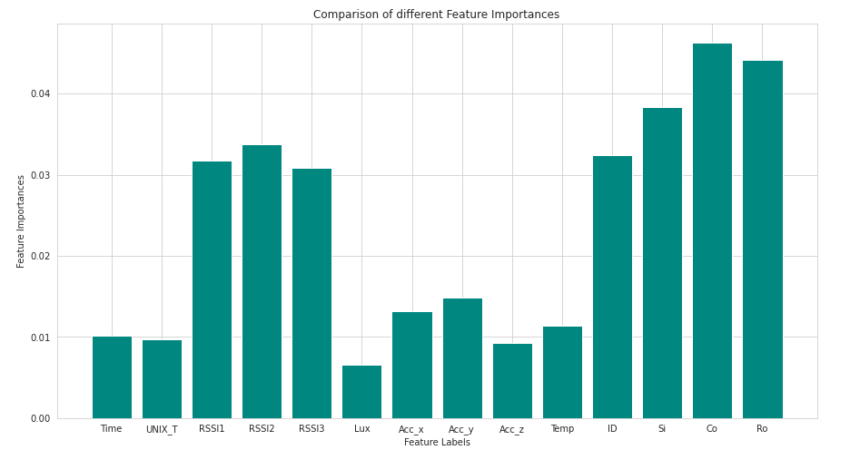
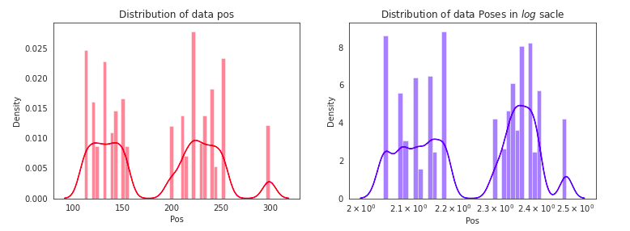
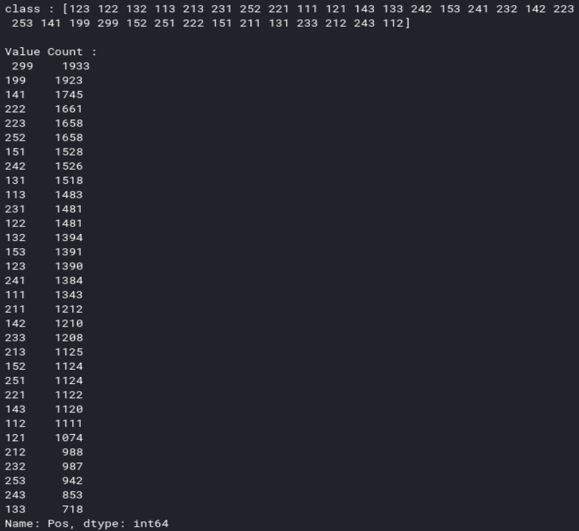
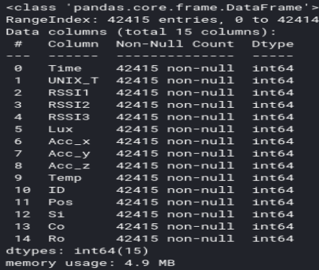
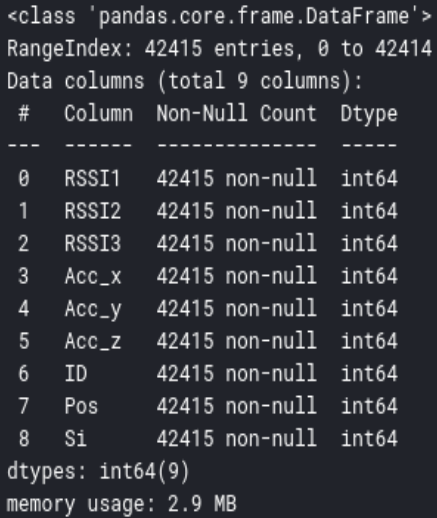
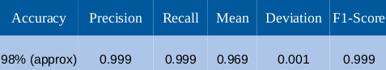

## PhyNetLab

The problem statement and the dataset of the problem is attached in the files.

After studying the dataset, I understood it is a classication problem. I used Random Forrest Classifier to train my model. This can also be done using other classification algorithms such as 
1. XGboost
2. K Nearest Neighbour. 
3. SVM
4. Decision Trees

Random Forrest Classifier is a very popular and powerful machine learning algorithm that uses supervised machine learning to to train data. It is capable of solving both classification and regression problem. It creates a forrest with multiple decision trees and takes the majority vote of those trees to train and predict the data. 

## Data Preprocessing
Data preprocessing has various steps. 
1. Feature Scalng
2. Dropping
3. Encoding
4. Splitting

## Feature Importance 

This helps us to find the most and least important features and columns for the target column Pos
## Data Distrubution 

We can see the distribution of data and the data density 
## Data Classes

Here we can see that the dataset is divided into various classes, hence we can say it is a classification problem
## Overfitting 
My model suffered from overfitting and it gave me 100% accuracy. I decided to drop some of the features after studying the feature diagram. I dropped 
Time, UNIX_T, Temp, Lux, Co, Ro after setting the ranges manually.
Before dropping

after dropping

After dropping the features, my model did not overfit my data and it gave me correct accuracy of 98%

## Cross Validation & Verdict

For cross validation, I calculated the Precision, Recall and F1 score. 
My precision, recall and F1 gave almost identical values which makes us wonder about the validity of our accuracy. They can only be identical when false positives and false negatives are equal. Here, I can conclude that although my model is giving me correct accuracy in theory, in practical terms, my model is not accurate. This might happen due to a problem in data preprocessing and data dropping. 
